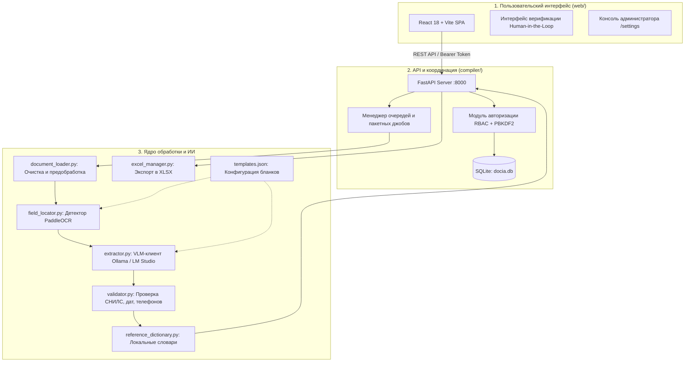

# 📑 DocAI Assistant — Обзор архитектуры и принципов работы

**DocAI Assistant** — локальная система на базе искусственного интеллекта для автоматизированного распознавания рукописных школьных заявлений (прием в 1/10 класс, профильные классы), верификации данных и формирования структурированной отчетности в формате Excel (`.xlsx`).

---

## 1. Назначение и ключевые особенности

* **100% локальный контур и защита персональных данных (ПДн):** Обработка документов выполняется локально или в доверенной школьной локальной сети (LAN). Внешние облачные API не используются; запросы к ИИ разрешены только на адреса loopback (`127.0.0.1`) и частные подсети RFC 1918 (`192.168.x.x`, `10.x.x.x`, `172.16.x.x`).
* **Обезличенное логирование (PII-safe):** В журналы системы и SQLite-базу никогда не записываются распознанные значения (ФИО, телефоны, паспорта, СНИЛС) и имена исходных файлов — фиксируются только метаданные (пользователь, тип действия, время выполнения, статус).
* **Гибридный подход к распознаванию (OCR + VLM):** 
  * Печатные метки и координаты строк определяет быстрый детектор **PaddleOCR (PP-OCRv6)**;
  * Рукописный текст и контекст бланка распознает мультимодальная нейросеть (**VLM**, например `Qwen2.5-VL:7b`) через **Ollama** или **LM Studio**;
  * При отсутствии PaddleOCR система бесшовно переключается на резервную геометрию из декларативного шаблона `templates.json`.
* **Человек в контуре (Human-in-the-Loop):** Система подсвечивает сомнительные поля (не сошедшийся СНИЛС, нетипичный формат телефона или даты, низкая уверенность), предлагает автоисправления из обучаемого локального справочника и позволяет оператору подтвердить правки перед экспортом.
* **Защита от дубликатов:** При пакетной загрузке документов алгоритм выявляет повторные заявления по совпадению СНИЛС или пары «ФИО + дата рождения».

---

## 2. Архитектура системы

Проект спроектирован по трёхзвенной модульной архитектуре с полным разделением интерфейса, серверного API и вычислительного ядра:

### 2.1. Веб-интерфейс (`web/`)
* **Технологии:** React 18, Vite, нативный адаптивный CSS.
* **Функционал:**
  * Загрузка одиночных изображений (`PNG`, `JPG`, `WEBP`) и многостраничных `PDF`.
  * Двухоконный режим: масштабируемый просмотр исходного скана слева и редактируемые поля справа.
  * Пакетная загрузка пачек документов с индикатором реального прогресса и кнопкой отмены.
  * Быстрая модальная проверка спорных полей перед скачиванием отчета.
  * Консоль администратора: переключение моделей VLM, настройка гиперпараметров (температура, лимит токенов, системный промпт), управление аккаунтами операторов и просмотр статистики.

### 2.2. Серверный слой (`compiler/`)
* **Технологии:** FastAPI, Uvicorn, SQLite3 (в режиме WAL), Pydantic v2.
* **Функционал:**
  * **Авторизация и безопасность (`compiler/auth.py`, `compiler/auth_store.py`):** Ролевой доступ (`admin` и `user`), хранение паролей с солью через PBKDF2-HMAC-SHA256 (600 000 итераций), скользящие токены сессий (24 ч TTL), защита от брутфорса (блокировка на 15 мин после 5 ошибок). Обязательная смена временного пароля при первом входе.
  * **Фоновые джобы (`compiler/jobs.py`):** Исключительная блокировка экстракции (`exclusive_extraction`), защищающая GPU от параллельных перегрузок, последовательная обработка пакетов, опрос статуса (polling) без передачи тяжелых данных до завершения.
  * **Автономная раздача («режим класса»):** В школьной сети компилятор на `0.0.0.0:8000` сам отдает и собранную статику React (`web/dist`), и API, избавляя от необходимости ставить Node.js на клиентские машины.

### 2.3. Вычислительное ядро (Корневые модули Python)
* **Загрузка и нормализация (`document_loader.py`):**
  * Чтение через Pillow и PyMuPDF (`fitz`).
  * Многостраничный PDF автоматически связывается в одно заявление ученика.
  * **Background Division Normalization:** удаление теней и выравнивание освещения делением яркости на гауссово размытие фона в пространстве YCbCr.
  * **Автокадрирование:** обрезка полей стола вокруг белого листа (экономия 25–30% полезного разрешения).
  * Мягкое увеличение резкости и микроконтраста для выявления бледной шариковой ручки без артефактов.
* **Локализация полей (`field_locator.py`):** Поиск печатных ключевых фраз (синонимов из шаблона) с помощью детектора `PP-OCRv6_medium_det`.
* **Взаимодействие с VLM (`extractor.py`):** 
  * Работа с Ollama (`ollama-python`) и любыми OpenAI-совместимыми `/v1` серверами (LM Studio, vLLM, llama.cpp).
  * Промпт со строгим JSON-форматом и графологическими правилами различия рукописных символов (например, «б» vs «д», «4» vs «7»).
  * Механизм автоматического восстановления поврежденного JSON.
* **Валидация (`validator.py`):**
  * Официальный алгоритм контрольной суммы СНИЛС (по методике ПФР/СФР по модулю 101).
  * Автоформатирование номеров телефонов РФ к виду `+7 (XXX) XXX-XX-XX`.
  * Проверка корректности календарных дат (`ДД.ММ.ГГГГ`).
  * Лингвистическая проверка совпадения фамилий ребенка и родителя.
* **Справочники (`reference_dictionary.py`):** Нечеткий поиск (Fuzzy matching / Levenshtein) по локальным базам фамилий, имен, отчеств, городов, образовательных профилей и самообучающемуся CSV-файлу пользовательских исправлений (`reference/custom_corrections.csv`).
* **Экспорт (`excel_manager.py`):** Формирование отчета `.xlsx` с помощью `openpyxl`. Стилизованное оформление («зебра», статусы), автоподбор ширины колонок и защита от формульных инъекций (экранирование символов `=, +, -, @`).

---

## 3. Конвейер обработки документа (Шаг за шагом)

1. **Загрузка:** Оператор выбирает файл (фото или PDF) в React-приложении. Файл передается через API в Base64.
2. **Предобработка:** `DocumentLoader` корректирует EXIF-ориентацию, срезает фон стола и нормализует освещение.
3. **Определение структуры:** `FieldLocator` ищет метки полей на бланке. При отсутствии детектора берутся резервные координаты из `templates.json`.
4. **Инференс нейросети:** VLM распознает рукописный текст с учетом контекста бланка и возвращает сырой JSON.
5. **Постобработка и контроль качества:** `DataValidator` нормализует даты, телефоны и проверяет контрольную сумму СНИЛС; `ReferenceDictionary` предлагает правки опечаток.
6. **Верификация:** Результат отображается в UI; оператор при необходимости вносит исправления в сомнительные поля одним кликом.
7. **Экспорт:** Данные пачки проверяются на внутренние дубликаты и выгружаются в файл Excel.

---

## 4. Структура репозитория

| Путь / Файл | Назначение |
|---|---|
| [`config.py`](config.py) | Центральная конфигурация: хосты, порты, параметры изображений, модели по умолчанию. |
| [`templates.json`](templates.json) | Декларативное описание бланков: поля, синонимы меток, резервная геометрия (добавление новых форм без изменения кода). |
| [`document_loader.py`](document_loader.py) | Предобработка: растеризация PDF, устранение теней, автообрезка стола, микроконтраст. |
| [`field_locator.py`](field_locator.py) | Детекция печатных якорей на базе PaddleOCR. |
| [`extractor.py`](extractor.py) | Клиент VLM (Ollama / LM Studio), системные промпты, автоисправление JSON. |
| [`validator.py`](validator.py) | Бизнес-правила: алгоритм СНИЛС, форматирование дат, телефонов, сверка фамилий. |
| [`reference_dictionary.py`](reference_dictionary.py) | Словари имен/фамилий/городов и накопление правок операторов. |
| [`excel_manager.py`](excel_manager.py) | Генерация `.xlsx`, экранирование формул, выявление дублей в пачке. |
| [`logging_utils.py`](logging_utils.py) | Потокобезопасное PII-safe логирование с correlation ID. |
| [`evaluate.py`](evaluate.py) | Скрипт бенчмаркинга точности: расчет CER (посимвольно) и WER (пословно) на тестовом датасете. |
| [`compiler/api.py`](compiler/api.py) | FastAPI сервер: эндпоинты аутентификации, экстракции, настроек и раздачи фронтенда. |
| [`compiler/auth_store.py`](compiler/auth_store.py) | SQLite-хранилище учетных записей, сессий и обезличенной статистики. |
| [`compiler/jobs.py`](compiler/jobs.py) | Очередь фоновых задач пакетной обработки и защита от одновременных запусков. |
| [`web/src/App.jsx`](web/src/App.jsx) | Основной компонент клиентского приложения (авторизация, загрузка, просмотрщик, модалки). |
| [`run.sh`](run.sh) | Скрипт быстрого запуска бэкенда и фронтенда в режиме разработки. |

---

## 5. Технический стек

* **Язык бэкенда:** Python 3.10–3.14 (все зависимости — в одном `requirements.txt`; PaddleOCR ставится на 3.10–3.12).
* **Фреймворк API:** FastAPI 0.115 + Uvicorn.
* **База данных:** SQLite 3 (WAL mode, встроенная, без внешних СУБД).
* **Фронтенд:** React 18, Vite, нативный CSS.
* **Обработка изображений:** Pillow 12, PyMuPDF 1.28, NumPy 2.
* **Генерация таблиц:** OpenPyXL 3.1.
* **Интеллектуальный слой:**
  * VLM: Любая мультимодальная модель (рекомендуется `qwen2.5-vl:7b`).
  * Среда инференса: Ollama или LM Studio / vLLM (OpenAI-совместимый протокол).
  * OCR-детектор (опционально): PaddleOCR (PP-OCRv6).
